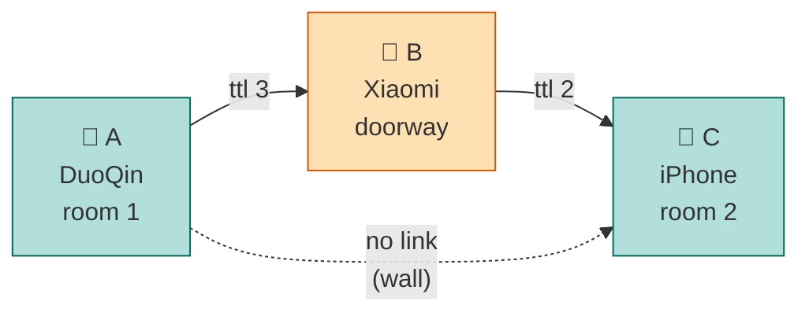

Hey, this is [Anipy](https://github.com/anipy1), mobile engineer at
[Bringin](https://bringin.app/). Some time back I installed bitchat on my iPhone,
turned off Wi-Fi and mobile data, and sent a message to a phone across the room.
It arrived. No account, no server, no SIM.

I wanted to know how that works, so I built one myself. This series is that.

There is no magic in it. It is Bluetooth Low Energy, a few hundred lines of
routing logic, and a handful of design decisions that you get to make yourself.

We are going to build a mesh messenger from scratch in Flutter. Not a wrapper
around bitchat, our own implementation of the same idea, written in Dart and
tested on real phones. By the end you will have a working mesh where a message
hops between two devices that cannot even see each other.

I am assuming you are a mobile developer who has maybe used a BLE package once to
talk to a smartwatch or a sensor, and that you have never written a network
protocol before. That is roughly where I started.

## What happens when you send a message

Take two phones in the same room. Each phone is doing two things at the same
time. It is shouting "I am here" into the air a few times a second, and it is
also listening for other phones shouting. When phone A hears phone B, it opens a
connection and they start sending bytes. That is the whole one hop case, and it is
most of what Part 3 covers.

Now put a wall between those two phones so they cannot hear each other, and stand
a third phone in the doorway. A sends a message. B, the one in the doorway, gets
it. The message still has hops left in its budget, so B passes it along. C gets
it. A and C never knew about each other.



That is the mesh. There is no routing table, no addresses, no path finding. Every
node just rebroadcasts what it hears. Each message carries a hop counter that goes
down by one every time it gets passed on, and every node keeps a list of message
IDs it has already seen so nothing goes around in circles. Flood, hop counter,
seen list. Three simple things and you have a network.

And no node knows the shape of the network, it only knows who is nearby. The shape
is whatever happens to be in range at that moment, and it keeps rearranging itself
as people move around, without anyone coordinating it.

### What it looks like when it works

Here is the log from three phones, one message going from A to C with B in the
middle. A and C cannot reach each other:

```
A (DuoQin)   send 70b48e 26B to 1 peer(s)
B (Xiaomi)   recv 70b48e 26B via write from A
B (Xiaomi)   relay 70b48e ttl 3->2 to 1 peer(s)
C (iPhone)   recv 70b48e 26B via write from B
C (iPhone)   RELAY-TEST-1   ·  1 hop  ·  ttl 2
```

Read it top to bottom and most of the protocol is right there. A sends to the only
neighbour it has, which is B. B receives it and passes it on with the hop counter
reduced from 3 to 2. C receives it, and C can actually tell the message came
through a relay instead of directly, because it says `1 hop · ttl 2`.

The seen list is the one thing not visible here, because it only shows up when a
message arrives twice. That happens all the time once you have more than three
phones, and it gets its own part later.

## What offline gets you, and what it costs

Good to know the limits before you start writing code, because they shape most of
the design.

What you get is communication with zero infrastructure. No cell tower, no router,
no server. Nothing to switch off, nothing for anyone to ask your data from,
nothing to bill you. Useful in a stadium where the network is jammed, in a
protest, on a flight, during a power cut, or anywhere the internet is blocked.

What it costs:

- **Range is short.** Phone to phone BLE is maybe 10 to 30 metres indoors with
  line of sight, and less through walls. Every extra hop is another chance to lose
  the message.
- **Bandwidth is small.** We will measure the real number on real hardware later.
  It is much closer to an old dial up modem than to Wi-Fi.
- **Latency varies.** Every hop adds delay, and as you will see in Part 9, a well
  behaved mesh actually adds even more delay on purpose.
- **Nothing is guaranteed to arrive.** No server is holding your message. If the
  path breaks, the message is gone. Store and forward helps, but the medium itself
  promises nothing.
- **Battery.** Advertising and scanning all the time is not free.

If you are used to building on HTTP, the shift is that this is a best effort
broadcast medium, not a reliable channel. It is much easier to design for that
from day one than to bolt it on later.

## Three things to decide before writing code

### 1. Where to look for reference

bitchat is open source in two places, a Swift version for iOS and macOS and a
Kotlin version for Android. Both implement the same protocol, so pick whichever
platform you are more comfortable reading and use it to see how the pieces fit
together.

I used them mostly to answer "what does a real implementation actually do here",
not to copy code. We are writing our own protocol anyway, so the value is in the
ideas and the structure, not the lines.

### 2. Compatible with bitchat, or your own protocol

This is a bigger fork in the road than it looks.

Being wire compatible means your users can message real bitchat users. It also
means you are chasing a moving target. bitchat is at v1.7.1 and still shipping
security related changes. Its internet transport uses something the README calls
"BitChat Private Envelopes", which the README itself says is not NIP-17/44/59
compatible, so you would be reverse engineering a custom crypto scheme on top of
all the BLE work. And the reference implementation does not claim any security
audit.

For a learning project, which is what this is, compatibility is a cost that buys
you nothing. Take the architecture, drop the compatibility, and the protocol is
yours to design. That is the choice I made, and it is also what makes Part 5 the
fun one, because you get to decide the wire format instead of copying one.

If you do want compatibility later, nothing here is wasted. You would just swap
the frame layout for theirs.

### 3. Rust, or plain Dart

You will see advice saying the protocol and the crypto belong in Rust behind
`flutter_rust_bridge`. I did consider it, and the honest answer needs a bit more
care than "there is a Dart package for that", because a package existing is not
the same as a package being maintained and reviewed.

So before depending on anything I look at more than whether it compiles. How many
apps actually use it, is it still getting commits, does more than one person
understand it, and how loudly does it fail if it is wrong. One thing worth knowing
here: the score you see on a pub.dev package page is automated. It checks
documentation, static analysis, null safety and so on. A package can sit at a
perfect score and still be something almost nobody has used or read.

That matters more now than it did a few years ago. Models are getting quite good
at reading code and finding real vulnerabilities in established open source
projects, including ones people trusted mainly because they had been around a long
time. So a dependency with very few users is a real risk, not just an
inconvenience.

For the transport, which is all we are deciding right now, the Dart packages hold
up. The BLE plugin we will use has around 10,000 downloads a month and real apps
depending on it, and if it misbehaves the failure is loud. A connection either
works or it does not. Later in the series, when we start adding things where a
quiet bug actually matters, the bar goes up and I will come back to this properly.

Flutter also already gives us one codebase for both platforms, so Rust would
mostly add a build step and an FFI boundary without buying much here.

And there is one piece that cannot move into a shared core no matter what you
choose. A mesh node has to advertise and scan at the same time, and those radio
APIs are per platform. As you will see in Part 2, that dual role is the main thing
that makes this different from normal BLE work.

So the plan is plain Dart above the radio. No Rust, no native platform channels.

## What we are building

A working mesh transport, in stages, each one tested on real phones:

1. Two phones exchanging bytes over BLE.
2. A wire format that can survive its own future versions.
3. Peers learning who each other are over a link.
4. Relay, so messages cross phones that cannot see each other.
5. A way to actually test a mesh, which is harder than building one.
6. Flood control, so the network does not drown in its own rebroadcasts.

Things we are skipping for now and picking up later: encryption, splitting long
messages into fragments, holding messages for peers who are offline, running in
the background, and app distribution. Each one is a real chunk of work and gets
its own part.

## What you need to follow along

This is the part where a lot of BLE tutorials quietly skip something important,
so let me be direct about it.

**You need real phones. At least two, and three if you want to see relay work.**
Emulators and simulators have no Bluetooth radio at all, so there is no way to
fake this on your laptop. If you only have one phone, you can still follow the
code and the reasoning, but you will not be able to run any of it.

**Mixed platforms are better than matched ones.** Two Android phones talking to
each other will work far more smoothly than Android talking to iOS, and that
smoothness is a lie. A lot of what makes this hard is the difference between the
two platforms, and if both your devices are Android you will not find those
problems until much later. If you can get one Android and one iPhone, do that.

For iOS you need to be able to install your own build on a device, so an Apple
developer account. The free tier is fine, builds just expire after seven days.

Flutter on any recent stable version, and Bluetooth switched on. One thing that
cost me some time and is worth knowing now: on Android 11 and below, BLE scanning
also needs **location services** switched on at the system level, not just the
location permission granted to your app. Turn the permission on, leave the system
toggle off, and scanning returns absolutely nothing with no error. We will come
back to that in Part 3.

## How I am doing this

Two things I want to set up front, because they affect everything after.

Everything gets tested on real hardware. Simulators and emulators have no
Bluetooth radio, so there is no shortcut. I used three devices and picked them to
be different on purpose: an Android 13 phone, an iPhone on iOS 26, and a DuoQin
F21 Pro. That last one is an Android 11 feature phone with a 480x640 screen and a
cheap MediaTek radio, and it found bugs the other two were hiding.

And I am leaving my mistakes in. This series comes from a real implementation and
a good chunk of it was wrong the first time. A blank grey screen that turned out
to be an exception thrown from a getter. A library that renamed my phones'
Bluetooth names system wide without telling me. A reconnect loop that flooded the
radio. A flood control timing window that I picked by guessing, then measured, and
found was about three times too small.

I could have written all of that out and shown you a clean design. That would be a
worse series. With BLE the failures are not side quests, the platform differences
and the timing surprises are the actual subject, and they are exactly what no API
doc will tell you.

## Next up

Part 2 is the concepts you need before we touch code. GATT, services and
characteristics, central versus peripheral, MTU and why your payloads end up so
small. Short, but enough that the code in Part 3 feels obvious instead of magic.

If you have only ever been the central in a BLE setup, so the phone talking to a
sensor, the interesting bit is what happens when you have to be both ends at once.

If you spot something wrong here or have questions, [ping me](https://x.com/Anipy1).
