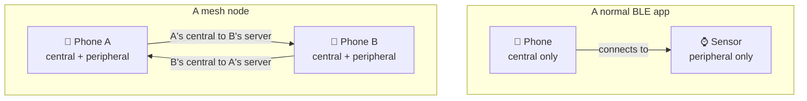

In [Part 1](#) we decided what we are building and what we are not. Plain Dart
above the radio, our own protocol instead of bitchat compatibility, tested on real
phones.

Now the concepts. This part has almost no code in it, and that is on purpose. BLE
has a handful of ideas that everything else sits on, and if you skip them the code
in Part 3 looks like magic incantations you copied from somewhere. If you get
them, the code reads as obvious.

I am keeping this short and practical. This is not a full BLE reference, it is the
subset you actually need to build a mesh.

## BLE is not Bluetooth

First thing to get out of the way, because it confused me at the start.

Bluetooth Classic and Bluetooth Low Energy are two different protocols that happen
to share a name and a radio. Classic is what your headphones and car stereo use.
It pairs, it holds a connection open, it streams audio, it moves files. BLE was
designed for something else entirely: send tiny bits of data, very rarely, on a
coin cell battery that has to last a year.

They are not two speeds of the same thing. Different APIs, different concepts,
different everything. Everything in this series is BLE. If you find a Stack
Overflow answer about `BluetoothSocket` or RFCOMM or pairing codes, that is
Classic, and it will not help you.

The practical consequence is that BLE is built around small amounts of data. That
is not a limitation you can engineer around, it is the shape of the thing, and it
ends up driving a lot of our design.

## Two roles: central and peripheral

Every BLE connection has two sides with different jobs.

A **peripheral** advertises. It shouts "I exist, and here is roughly what I offer"
into the air a few times a second, then waits. It holds the data. Your smartwatch,
a heart rate strap, a temperature sensor, a beacon.

A **central** scans. It listens for advertisements, picks one, connects to it, and
then reads and writes the peripheral's data. This is usually the phone.

If you have used BLE in an app before, you were almost certainly the central. That
is what every tutorial teaches, because that is what most apps do. Phone connects
to device, phone reads values from device.

Here is the part that matters for us: **these are roles, not device types.** A
phone can be a peripheral. A phone can be both a central and a peripheral at the
same time. Nothing in the spec says a phone has to be the central, that is just
the common case. And as we will see at the end of this part, a mesh depends
entirely on a phone being able to do both at once.

## Advertising and scanning

An advertisement is a tiny broadcast packet. In the common format you get about 31
bytes total, and that is not 31 bytes of your data, it is 31 bytes for everything
including the flags and the structure around each field.

Into those bytes you can put things like:

- **Service UUIDs**, saying "I speak this protocol". A 128 bit custom UUID eats 16
  of your bytes by itself.
- **A local name**, which is what shows up in a Bluetooth scanner app.
- **Manufacturer specific data**, a small blob of whatever you like.

A central scanning can see all of this without connecting. That is useful, and it
is also why you can filter your scan by service UUID and only get told about
devices running your app instead of every wireless earbud in the building.

Two things to remember from this section, both of which come back later:

The advertisement is **very small**. When you eventually want to put your own
information in there, you will run out of space fast, and in Part 6 you will see
that trying to put identity in the advertisement was a mistake for a reason I did
not expect at all.

And scanning is **cheap but not free**. You are keeping the radio listening. This
is where a lot of your battery goes.

## GATT: the data model

Once a central connects to a peripheral, they talk over something called GATT, the
Generic Attribute Profile. Ignore the name. The useful way to think about GATT is
that the peripheral exposes a very small, very simple key value store, and the
central can read and write entries in it.

It has three levels:

**Service.** A group of related things, identified by a UUID. "Heart rate
service", "battery service", or in our case "mesh service". A peripheral can
expose several services.

**Characteristic.** The actual value, also identified by a UUID. This is the thing
you read from and write to. A service holds one or more characteristics. Standard
ones have short 16 bit UUIDs assigned by the Bluetooth SIG, and anything you invent
yourself gets a random 128 bit UUID. We will generate our own in Part 3.

**Descriptor.** Metadata attached to a characteristic. Mostly you can ignore these,
with one exception that matters and I will come back to.

Each characteristic has **properties** that say what you are allowed to do with
it: read, write, write without response, notify, indicate. Those properties are not
decoration, they decide which of the three data paths below you can use.

## The three ways data actually moves

This is the section I wish I had read first, because it explains a constraint that
shapes everything.

**Read.** The central asks, the peripheral answers. Central starts it.

**Write.** The central sends a value to a characteristic. Two flavours: *with
response*, where the peripheral acknowledges and you know it arrived, and *without
response*, which is faster and gives you no confirmation. Central starts it.

**Notify.** The peripheral pushes a value to the central without being asked. But
there is a catch, and it is a big one: the central has to **subscribe** first. That
subscription is the one descriptor worth knowing about, and until the central turns
it on, the peripheral cannot push anything. (Indicate is the same idea with an
acknowledgement, and slower. We will use notify.)

Notice what all three have in common. **The central starts everything.** Read,
write and even subscribing are all central initiated. A peripheral cannot decide
to send you something out of nowhere. The only way a peripheral speaks first is by
notifying on a characteristic that a central already subscribed to.

So if you want data flowing in both directions, you need to plan for it. One
characteristic the central writes to, and one characteristic the central subscribes
to so the peripheral can notify on it. Two characteristics, two directions. That
pattern shows up in almost every serial-over-BLE design, and we will use it too.

## MTU, or why your payloads are so small

Two more short names here and then we are done with acronyms.

**ATT** is the Attribute Protocol, and it sits directly under GATT. The way I
think about the split is that GATT is the meaning and ATT is the plumbing. GATT is
where you get services, characteristics and properties, the structure we just went
through. ATT is the layer below that actually moves bytes over the radio. Every
read, write and notify you do in GATT turns into one or more ATT packets
underneath.

**MTU** stands for Maximum Transmission Unit. It is just the size of the largest
single ATT packet that the two devices have agreed to use for this connection.
Anything bigger than that does not fit in one packet, so it has to be broken into
pieces.

So the MTU is the number that decides how many bytes you can move in one
operation, and it is worth knowing because the starting value is genuinely tiny.

The default is **23 bytes**. Three of those are protocol overhead, so you get
**20 bytes** of actual payload. Twenty. That is your starting point.

You can negotiate it upwards after connecting, and how far you get depends on both
devices and the platform. The numbers you will read online are that Android can go
up to 517 and iOS usually settles around 185.

On my three phones I measured **517 negotiated, with 512 bytes usable**, in both
directions, including the legs involving the iPhone. That is a lot better than the
185 I was expecting.

The lesson there is not "iOS gives you 512". It is that these numbers depend on the
devices, the platform versions and who asks for what, so you should **read the real
value at runtime instead of assuming one**. In Part 3 we will do exactly that, and
print it, because designing against a number you guessed is how you end up with
messages that silently fail on one device and work fine on another.

Anything bigger than the negotiated size has to be split into pieces and
reassembled at the other end. That is fragmentation, and it is a later part. For
now, 512 bytes is plenty for text messages.

## Why a mesh is different

Everything above is standard BLE and applies to any app. Here is where mesh work
departs from every tutorial.

In a normal BLE app the roles are fixed and obvious. Your phone is the central, the
sensor is the peripheral. The asymmetry is baked into the product.

In a mesh, every node is the same kind of thing. There is no sensor and no phone,
just peers. And a peer has to be **findable** and also has to be **looking**.
Findable means advertising, which means being a peripheral. Looking means scanning
and connecting, which means being a central.

So every phone has to run both sides at the same time. A GATT server, exposing our
mesh service, so other phones can connect to it. And a GATT client, scanning and
connecting to other phones' servers.

Look at the bottom half of that diagram and you can already see a problem. When
phone A and phone B meet, there are **two** connections they could form. A's
central can connect to B's server, and B's central can connect to A's server. Both
work. Both are full duplex. So which one should carry the messages?

If both sides just connect, you get two connections per pair of phones, which
wastes a connection slot and means every message arrives twice. If both sides
politely wait for the other to connect, nothing happens at all. There is no
obvious right answer, and finding one took me a few tries and one genuinely
surprising discovery about how Android reports connections. That is Part 6.

## The design this gives us

Put all of the above together and the shape of what we are building falls out
almost on its own:

- **One service UUID** for the mesh. Every phone advertises it, and every phone
  filters its scan on it, so we only ever talk to our own app.
- **One characteristic for notify**, which I will call TX. This is how a phone
  acting as peripheral sends to a connected central.
- **One characteristic for write**, which I will call RX. This is how a phone
  acting as central sends to a peripheral.
- Every phone exposes **the same service with the same two characteristics**, so
  any phone can play either role depending on who connected to whom.

That is the whole GATT design. One service, two characteristics, and it is
symmetric so every node is interchangeable.

The direction rules then follow directly from the three data paths above. If I
connected to you, I am the central, so I send by writing to your RX and I receive
by subscribing to your TX. If you connected to me, it is the other way around. In
the logs in Part 1 you may have noticed lines like `recv 70b48e 26B via write from
A`. That `via write` is telling you which of these two paths the message took.

## One thing about platforms, before you get surprised

iOS and Android both implement all of this, and they disagree in ways that will
cost you time. There is a whole part later that is nothing but a catalogue of
those differences, so I will not front load it here.

But one is worth knowing before you write any code, because it affects what your
app can promise. **iOS heavily restricts what a backgrounded app can advertise.**
When your app is not in the foreground, iOS drops the local name from your
advertisement and moves your service UUID into a secondary area that is only
discoverable by another iOS device explicitly scanning for that exact UUID. Android
is much more relaxed about this.

The practical result is that a mesh where iPhones need to participate while the app
is in the background is a harder product than it looks, and no amount of clever
Dart fixes it, because the restriction lives below anything you can reach. Worth
knowing now rather than after you have built everything.

## Next up

Part 3 is code. We will set up a Flutter project that runs both GATT roles at once,
handle the permissions on both platforms (including the Android one that silently
returns nothing if you get it wrong), stand up the service with the TX and RX
characteristics, and get an actual byte from an Android phone to an iPhone.

That is also where we find out whether the plan from Part 1, plain Dart above the
radio, survives contact with real hardware.

If something here does not make sense or I have got something wrong,
[ping me](https://x.com/Anipy1).
